# Semantic Cache Demo - Specification

## Overview

This specification defines a **semantic caching demonstration using AWS-native services only**. The goal is to showcase how vector embeddings and similarity search can reduce LLM costs and latency by caching responses to semantically similar queries.

**Key Principle:** Use only AWS services (S3 Vectors, Bedrock, Lambda) - no external vector databases or third-party dependencies.

## Solution Approach

### Why Semantic Caching?

Traditional caching uses exact string matching. But users ask the same question in different ways:
- "What's your refund policy?"
- "How do I get a refund?"
- "Can I return this for my money back?"

These are different strings but semantically identical. Semantic caching uses vector embeddings to match meaning, not text.

### AWS Services Used

| Service | Purpose | Why This Service |
|---------|---------|------------------|
| **Amazon S3 Vectors** | Vector storage + similarity search | Serverless, no infrastructure, native AWS |
| **Amazon Bedrock - Titan V2** | Generate embeddings (1024-dim) | AWS-native, optimized for similarity |
| **Amazon Bedrock - Claude Haiku 4.5** | Generate LLM responses | Fast, cost-effective |
| **AWS Lambda** | Orchestration logic | Serverless compute |
| **API Gateway** | HTTP endpoint | Managed API layer |
| **CloudWatch** | Metrics and logging | Native observability |

### Architecture Decisions

| Decision | Choice | Rationale |
|----------|--------|-----------|
| **No VPC** | Lambda without VPC | Faster cold starts (~300ms vs ~5s), lower cost, simpler |
| **S3 Vectors** | Serverless vector DB | No baseline cost, native similarity search, AWS-managed |
| **Titan V2 Embeddings** | Over external providers | AWS-native, 1024 dimensions, good quality |
| **Similarity Threshold 0.85** | Balance precision/recall | Higher = fewer false positives, lower = more cache hits |

## Model Configuration

**Verified January 2026** - Always check AWS documentation for latest model IDs.

| Model | ID | Purpose |
|-------|-----|---------|
| Titan Embeddings V2 | `amazon.titan-embed-text-v2:0` | 1024-dimensional embeddings |
| Claude Haiku 4.5 | `us.anthropic.claude-haiku-4-5-20251001-v1:0` | LLM responses (inference profile) |

## Prerequisites

**⚠️ Verify Latest AWS Documentation:** Model IDs, pricing, and availability change frequently. Check [Bedrock Models](https://docs.aws.amazon.com/bedrock/latest/userguide/models-supported.html) and [S3 Vectors](https://docs.aws.amazon.com/AmazonS3/latest/userguide/s3-vectors.html) before deployment.

**Models:** Auto-enable on first use (no manual setup)
- Amazon Titan Embeddings V2: `amazon.titan-embed-text-v2:0`
- Claude Haiku 4.5: `us.anthropic.claude-haiku-4-5-20251001-v1:0` (inference profile)

**Regions:** us-east-1 (recommended), us-east-2, us-west-2, eu-west-1, ap-northeast-1

**Tools:** AWS CLI v2+, SAM CLI v1+, AWS credentials configured

**IAM Permissions:** CloudFormation, IAM, Lambda, API Gateway, S3 Vectors, Bedrock, CloudWatch

## Problem Statement

Every query to Amazon Bedrock costs money and takes 1-2 seconds. 30-50% of queries are semantically identical to previously answered questions. "What's your refund policy?" and "How do I get a refund?" are different strings but the same question. Organizations pay full price to answer these repeatedly.

## Solution

Use vector embeddings to match query meaning instead of exact strings. Cache responses and return cached results when a new query is semantically similar (>85% similarity) to a previously answered query.

## Architecture



**Source:** `semantic_cache_architecture_updated.mmd` (export as PNG/SVG via [Mermaid Chart](https://mermaid.ai/app/dashboard))

```
┌─────────────────────────────────────────────────────────────────────────────────────┐
│                                                                                     │
│  ┌──────────────┐    ┌─────────────────────┐    ┌─────────────────────────────────┐│
│  │ Application  │ 1. │    API Layer        │ 2. │    Orchestration Layer         ││
│  │    Users     │───▶│    ───────────      │───▶│    ────────────────────        ││
│  │              │Query│   API Gateway      │Route│   Cache Orchestrator          ││
│  └──────────────┘    └─────────────────────┘    │       (Lambda)                 ││
│         ▲                                       └────────────┬───────────────────┘│
│         │                                                    │                     │
│         │ Response                          3. Generate      │                     │
│         │                                      Embedding     │                     │
│         │                                           ┌────────┴────────┐            │
│         │                                           ▼                 ▼            │
│         │        ┌────────────────────────────────────┐  ┌───────────────────────┐│
│         │        │   Semantic Cache Layer             │  │   AI/ML Layer         ││
│         │        │   ──────────────────────           │  │   ────────────        ││
│         │        │   Amazon S3 Vectors                │  │   Amazon Bedrock      ││
│         │        │   (Serverless Vector DB)           │  │                       ││
│         │        │  ┌──────────────────────────────┐  │  │ ┌───────────────────┐ ││
│         │        │  │    Vector Index              │  │  │ │ Titan Text        │ ││
│         │        │  │    (Cosine Similarity)       │  │  │ │ Embeddings V2     │ ││
│         │        │  └──────────────────────────────┘  │  │ └───────────────────┘ ││
│         │    7.  │               ▲                    │  │          │            ││
│         │  Store │               │                    │  │          │ 3.        ││
│         │    in  │               │ 4. Vector Search   │  │          ▼            ││
│         │  Cache │               │                    │  │ ┌───────────────────┐ ││
│         │        │               │                    │  │ │ Claude Haiku 4.5  │ ││
│         │        └───────────────┼────────────────────┘  │ └───────────────────┘ ││
│         │                        ▼                       │          │            ││
│         │              ┌─────────────────┐               │          │ 6.        ││
│         │              │ 5a. Cache HIT   │               │          │ LLM       ││
│         │              │   (~10x faster) │───────────────┼──────────┘ Response  ││
│         │              └─────────────────┘               │                       ││
│         │                        │                       │                       ││
│         │              ┌─────────────────┐               │                       ││
│         └──────────────│ 5b. Cache MISS  │───────────────┼───────────────────────┘│
│                        │   (Invoke LLM)  │               │                        │
│                        └─────────────────┘               └────────────────────────┘
│                                                                                     │
│         ┌───────────────────────────────────────────────────────────────────────┐  │
│         │   Observability                                                        │  │
│         │   ─────────────                                                        │  │
│         │   CloudWatch Metrics                                                   │  │
│         └───────────────────────────────────────────────────────────────────────┘  │
│                                                                                     │
└─────────────────────────────────────────────────────────────────────────────────────┘
```

## Flow Steps (per diagram)

| Step | Action | From | To |
|------|--------|------|-----|
| 1 | Query | Application Users | API Gateway |
| 2 | Route | API Gateway | Cache Orchestrator (Lambda) |
| 3 | Generate Embedding | Cache Orchestrator | Titan Text Embeddings V2 |
| 4 | Vector Search | Cache Orchestrator | S3 Vectors Index |
| 5a | Cache HIT (~10x faster) | Vector Index | Return Response |
| 5b | Cache MISS | Cache Orchestrator | Claude Haiku 4.5 |
| 6 | LLM Response | Claude Haiku 4.5 | Cache Orchestrator |
| 7 | Store in Cache | Cache Orchestrator | S3 Vectors |

## Layers & AWS Services

| Layer | Service | Component | Model ID / Details |
|-------|---------|-----------|-------------------|
| API Layer | API Gateway | HTTP API | REST endpoint, CORS enabled |
| Orchestration Layer | Lambda | Cache Orchestrator | Python 3.11, 512MB, 30s timeout, **no VPC** |
| Semantic Cache Layer | Amazon S3 Vectors | Vector Bucket + Index | Serverless, cosine similarity, 1024 dimensions |
| AI/ML Layer | Amazon Bedrock | Titan Embeddings | `amazon.titan-embed-text-v2:0` (1024-dim) |
| AI/ML Layer | Amazon Bedrock | Claude Haiku 4.5 | `us.anthropic.claude-haiku-4-5-20251001-v1:0` (inference profile) |
| Observability | CloudWatch | Metrics & Logs | Namespace: SemanticCache |

### S3 Vectors Architecture

Amazon S3 Vectors provides serverless vector storage with native similarity search:

```
S3 Vectors
├── Vector Bucket (semantic-cache-demo-vectors-{account})
│   └── Vector Index (semanticcache)
│       ├── Dimension: 1024
│       ├── Distance Metric: Cosine
│       └── Metadata: query, response
```

**How it works:**
1. Create a vector bucket using S3 Vectors API
2. Create a vector index inside the bucket
3. Use `put_vectors` to store embeddings with metadata
4. Use `query_vectors` to find similar vectors (top-k search)

**Benefits of S3 Vectors:**
- **No VPC required** - faster cold starts (~300ms)
- **No baseline cost** - pay only for storage and queries
- **Fully serverless** - no capacity planning needed
- **Simpler architecture** - fewer components to manage

## Architectural Decisions

| Decision | Choice | Rationale | Trade-off |
|----------|--------|-----------|-----------|
| **Compute** | Lambda (no VPC) | Fast cold starts, simple architecture | N/A |
| **Cache** | S3 Vectors | Serverless vector search, no baseline cost | Newer service |
| **Embeddings** | Titan V2 (1024-dim) | AWS-native, good quality, fast | Smaller dimension than OpenAI ada-002 |
| **LLM** | Claude Haiku 4.5 | Fast, cost-effective, improved quality | Less capable than Sonnet/Opus |
| **API** | HTTP API (not REST API) | Lower cost, lower latency | Fewer features than REST API |
| **Auth** | None (for demo) | Easy testing | Not production-ready |

## Production Recommendations

This demo provides a foundation. For production use, implement the following enhancements:

### Security Hardening

| Enhancement | Implementation | Priority |
|-------------|----------------|----------|
| **API Authentication** | Cognito User Pools, IAM auth, or API keys | High |
| **AWS WAF** | Protect against SQL injection, XSS, rate abuse | High |
| **Private API** | VPC endpoints if internal-only access needed | Medium |
| **Secrets Management** | AWS Secrets Manager for any API keys | Medium |

### Performance & Scalability

| Enhancement | Implementation | Benefit |
|-------------|----------------|---------|
| **Provisioned Concurrency** | Lambda provisioned concurrency | Eliminate cold starts |
| **Cache Warming** | Pre-populate cache with common queries | Immediate cache hits |
| **Multi-Region** | Deploy stack to multiple regions | Global low latency |
| **Response Streaming** | Bedrock streaming for long responses | Better UX |

### Observability

| Enhancement | Implementation | Benefit |
|-------------|----------------|---------|
| **X-Ray Tracing** | Enable on Lambda and API Gateway | End-to-end visibility |
| **CloudWatch Alarms** | Alert on error rates, latency P99 | Proactive monitoring |
| **Custom Dashboard** | Cache hit rate, cost savings metrics | Business insights |
| **Log Insights** | Query patterns, error analysis | Debugging |

### Data Management

| Enhancement | Implementation | Benefit |
|-------------|----------------|---------|
| **TTL Strategy** | Expire cache entries based on freshness | Data accuracy |
| **Cache Invalidation API** | Endpoint to clear specific entries | Control over stale data |
| **Backup/Export** | Periodic S3 Vectors data export | Disaster recovery |
| **Versioning** | Track embedding model versions | Reproducibility |

### Cost Optimization

| Enhancement | Implementation | Benefit |
|-------------|----------------|---------|
| **Threshold Tuning** | A/B test similarity thresholds | Optimize hit rate vs accuracy |
| **Response Limits** | Cap max tokens in LLM responses | Control costs |
| **Reserved Capacity** | Bedrock provisioned throughput | Predictable pricing |
| **Usage Analytics** | Track cost per query, savings | ROI measurement |

## Functional Requirements

### FR-1: Query Endpoint (Step 1-2)
- POST /query accepts JSON body with `query` field
- API Gateway routes to Cache Orchestrator Lambda
- Returns JSON with `response`, `source` (cache/bedrock), `latency_ms`
- If cache hit, also returns `similarity` score

### FR-2: Embedding Generation (Step 3)
- Cache Orchestrator calls Amazon Bedrock
- Model: `amazon.titan-embed-text-v2:0`
- Output: 1024-dimensional float vector
- Normalize: true (for cosine similarity)

### FR-3: Vector Search (Step 4)
- Cache Orchestrator queries S3 Vectors
- Use `query_vectors` API with topK=1
- Returns distance (converted to similarity)
- Includes metadata (query, response)

### FR-4: Cache Hit Path (Step 5a)
- If similarity >= threshold (default 0.85)
- Return cached response immediately
- ~10x faster than LLM path
- Log to CloudWatch Metrics

### FR-5: Cache Miss Path (Step 5b, 6)
- If similarity < threshold
- Cache Orchestrator calls Bedrock LLM
- Use Claude Haiku 4.5
- Max tokens: 1024
- Return LLM response

### FR-6: Store in Cache (Step 7)
- After cache miss, store new entry
- Store: query, embedding, response (as metadata)
- Key format: `cache_{md5(query)}`
- Target: S3 Vectors

### FR-7: Observability
- Publish to CloudWatch namespace `SemanticCache`
- Metrics: CacheHit (0/1), Latency (ms)
- Dashboard with hit rate, latency, request count

## Non-Functional Requirements

### NFR-1: Performance
- Cache hit latency: <500ms (Step 5a path)
- Cache miss latency: <5000ms (Step 5b-6-7 path)
- Support 100 concurrent requests

### NFR-2: Reliability
- Graceful degradation: if cache fails, fall back to direct Bedrock
- Cache is optimization layer, not dependency

### NFR-3: Security

**Serverless Security Model (No VPC Required)**

This demo uses IAM-based security rather than network isolation:

| Security Layer | Implementation |
|----------------|----------------|
| **Authentication** | IAM SigV4 signatures for all AWS API calls |
| **Authorization** | IAM policies with least privilege |
| **Encryption in Transit** | TLS 1.2+ for all service communication |
| **Encryption at Rest** | AWS-managed encryption for S3 Vectors |
| **Rate Limiting** | API Gateway throttling |
| **Input Validation** | Lambda validates all inputs |

**Why No VPC?**
- S3 Vectors and Bedrock are fully managed services accessed via authenticated APIs
- No EC2 instances or databases requiring network isolation
- VPC would add ~5s cold start latency
- Security is enforced at the API/IAM level, not network level

**Demo Security Settings:**
- IAM least privilege for Lambda execution role
- **API Gateway:** 
  - Throttling: 100 requests/second burst, 50 requests/second steady
  - Request validation: max body size 10KB
  - No authentication (for easy testing) - add for production
- Input validation: reject queries > 8000 characters (Titan limit)

### NFR-4: Cost

**Service Costs (verify at [AWS Pricing](https://aws.amazon.com/pricing/)):**

| Service | Pricing Model | Estimate |
|---------|---------------|----------|
| S3 Vectors | Storage + queries | Usage-based, minimal for demo |
| Lambda | $0.20/1M requests + compute | Minimal |
| API Gateway HTTP | $1.00/1M requests | Minimal |
| Bedrock Titan V2 | ~$0.00002/1K tokens | Embedding generation |
| Bedrock Claude Haiku | ~$0.001/1K input tokens | LLM responses |

**Demo Cost Estimate:** < $1.00 for a few hours of testing

- **Fully serverless** - no fixed infrastructure costs
- **Pay per use** - no minimum baseline charges
- **IMPORTANT:** Delete resources immediately after demo
- Target: 50%+ Bedrock cost reduction at 50% cache hit rate

### NFR-5: Error Handling
- Bedrock throttling: Exponential backoff (3 retries, base 1s)
- S3 Vectors failure: Fall back to direct Bedrock (no retry)
- Embedding failure: Return 500 error with message
- LLM failure: Return 500 error with message
- All errors logged to CloudWatch

## Configuration

| Parameter | Default | Description |
|-----------|---------|-------------|
| SIMILARITY_THRESHOLD | 0.85 | Minimum similarity for cache hit (Step 5a vs 5b) |
| VECTOR_BUCKET_NAME | (required) | S3 Vectors bucket name |
| VECTOR_INDEX_NAME | semanticcache | S3 Vectors index name |
| LLM_MODEL | claude-haiku-4-5-20251001-v1:0 | Bedrock model for Step 5b-6 |

## Project Structure

```
semantic-cache-demo/
├── README.md
├── semantic_cache_architecture_updated.mmd    # Architecture diagram source
├── semantic_cache_architecture_updated.svg   # Architecture diagram (rendered)
├── SPEC.md                            # This file
├── infrastructure/
│   ├── template.yaml                  # SAM template (CloudFormation)
│   └── samconfig.toml                 # SAM configuration
├── src/
│   └── cache_orchestrator/            # Lambda function (Orchestration Layer)
│       ├── __init__.py
│       ├── handler.py                 # Main Lambda handler (Steps 2-7)
│       ├── embedding.py               # Titan Embeddings client (Step 3)
│       ├── cache.py                   # S3 Vectors client (Steps 4, 5a, 7)
│       ├── llm.py                     # Bedrock LLM client (Steps 5b, 6)
│       ├── metrics.py                 # CloudWatch metrics (Observability)
│       └── requirements.txt           # Lambda function dependencies
├── tests/
│   ├── unit/
│   │   ├── test_embedding.py          # Step 3 tests
│   │   ├── test_cache.py              # Steps 4, 5a, 7 tests
│   │   ├── test_llm.py                # Steps 5b, 6 tests
│   │   └── test_handler.py            # Full flow tests
│   └── integration/
│       └── test_api.py                # End-to-end tests
├── scripts/
│   ├── deploy.sh                      # One-click deploy (with cost warning)
│   ├── test-demo.sh                   # Demo script showing all steps
│   ├── cleanup.sh                     # Delete ALL resources
│   └── check-prereqs.sh               # Verify prerequisites before deploy
```

## Implementation Tasks

**Infrastructure:** API Gateway HTTP API (throttling: 100/50 req/s), Lambda (Python 3.11, 512MB, 30s, no VPC), S3 Vectors (Custom Resource), IAM roles, CloudWatch Dashboard

**Modules:**
- **embedding.py:** Bedrock client, `generate_embedding()` → 1024-dim vector (Titan V2), normalized, throttling retry
- **cache.py:** S3 Vectors client, `search_cache()`, `store_in_cache()`, graceful degradation
- **llm.py:** Bedrock client, `invoke_llm()` → Claude Haiku 4.5, max 1024 tokens, throttling retry
- **metrics.py:** CloudWatch client, `publish_metrics()` → namespace `SemanticCache`, CacheHit + Latency
- **handler.py:** Parse request, validate input (400 if missing/invalid), orchestrate Steps 2-7, return JSON

**Scripts:** `check-prereqs.sh`, `deploy.sh` (cost warning), `test-demo.sh`, `cleanup.sh` (delete all resources)

**Tests:** Unit tests (mocked clients), integration tests (end-to-end), demo script validation

## Test Scenarios

**Unit Tests:** Embedding (1024-dim), cache search (hit/miss), cache store, LLM invocation, handler validation (400 errors), graceful degradation

**Integration Tests:** Deploy stack, cache miss path (Steps 1-2-3-4-5b-6-7), cache hit path (Steps 1-2-3-4-5a), semantic similarity hit, CloudWatch metrics, cleanup verification

**Demo Script:** `test-demo.sh` tests: first query (miss), same query (hit), similar query (hit), different query (miss). Expected latencies: miss ~3000ms, hit ~300ms.

## Cleanup Requirements

**Single command cleanup:** `./scripts/cleanup.sh` must delete ALL resources (S3 Vectors bucket/index, Lambda, API Gateway, CloudWatch logs/dashboard, IAM roles).

**CloudFormation:** All resources must have `DeletionPolicy: Delete`. Cleanup script must wait for stack deletion and remove orphaned CloudWatch log groups.

**Cost warnings:** `deploy.sh` must warn users before deployment. `test-demo.sh` must remind users to cleanup after demo.

## Success Criteria

1. One-click deployment works (`./scripts/deploy.sh`)
2. All 7 steps execute correctly per diagram
3. Cache hit path (5a) is ~10x faster than miss path (5b-6-7)
4. Cache hit rate >40% on repetitive queries
5. CloudWatch dashboard shows metrics
6. Demo script demonstrates all paths
7. **One-click cleanup works (`./scripts/cleanup.sh`)**
8. **Zero resources remain after cleanup**
9. **Zero ongoing charges after cleanup**

## Dependencies

### Python
- boto3 (included in Lambda runtime)

### AWS Services & Models
- **Bedrock Models (must be enabled in console):**
  - `amazon.titan-embed-text-v2:0` (Step 3 - Embeddings)
  - `us.anthropic.claude-haiku-4-5-20251001-v1:0` (Step 5b-6 - LLM, inference profile)
- Lambda concurrent executions (default 1000 is sufficient)
- S3 Vectors (check region availability)

### Tools
- AWS CLI >= 2.0
- AWS SAM CLI >= 1.0
- Python 3.11+ (for local testing)
- jq (for demo script output formatting)

## Troubleshooting

| Error | Cause | Solution |
|-------|-------|----------|
| `AccessDeniedException` on Bedrock | Model access not enabled | Enable models in Bedrock Console (see Prerequisites) |
| `ResourceNotFoundException` for cache | S3 Vectors index not found | Wait for stack to complete, check custom resource logs |
| `ThrottlingException` on Bedrock | Too many requests | Retry logic handles this; reduce concurrency if persistent |
| Stack deletion stuck | Resources have dependencies | Check CloudFormation events; manually delete if needed |
| High latency on first request | Lambda cold start | Expected (~300ms); subsequent requests will be fast |
| `ValidationException` on embedding | Input text too long | Titan V2 limit is 8192 tokens; truncate if needed |

## Demo Scope & Limitations

### What This Demo Covers
- Core semantic caching pattern using AWS services
- Vector embedding generation and similarity search
- Graceful degradation (cache failures don't break the system)
- Basic observability with CloudWatch metrics
- One-click deployment and cleanup

### What This Demo Does NOT Cover
- Authentication/authorization (API is public)
- Multi-tenancy or user isolation
- Cache invalidation strategies
- High availability / multi-region
- Production-grade monitoring and alerting

### Known Limitations

1. **Cold Start:** First Lambda invocation takes ~300ms (no VPC). Subsequent calls are fast.
2. **Cache Warm-up:** Cache starts empty; first queries will always miss.
3. **Single Region:** Demo deploys to one region only.
4. **No Authentication:** API is public for easy demo testing.
5. **S3 Vectors:** Newer service - check region availability.

## Technical Notes

- **Model IDs:** Verify against AWS documentation before deployment - they change frequently
- **Diagram:** Source in `semantic_cache_architecture_updated.mmd` (export via [Mermaid Chart](https://mermaid.ai/app/dashboard))
- **Embeddings:** Titan V2 outputs **1024 dimensions** (not 1536)
- **Similarity:** S3 Vectors uses cosine distance; similarity = 1 - distance
- **Threshold:** 0.85 balances precision (fewer false hits) vs recall (more cache hits)
